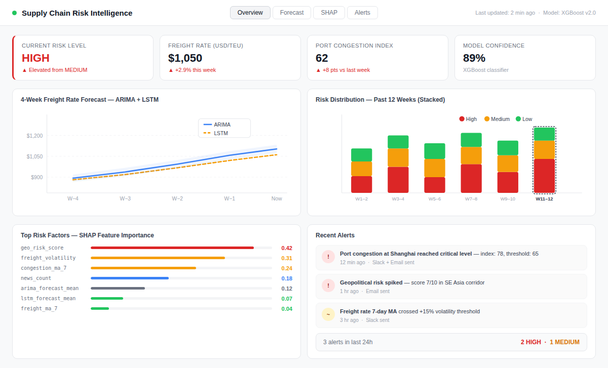

# 🚀 Supply Chain Risk Intelligence System

An end-to-end AI-powered supply chain risk prediction platform that forecasts disruptions **4–8 weeks in advance** using hybrid time-series modeling, NLP sentiment analysis, and XGBoost classification — all served through a FastAPI backend and a live Plotly Dash dashboard.

---

## 📌 Overview

Global supply chains are highly vulnerable to disruptions from port strikes, geopolitical conflicts, freight rate spikes, and logistics bottlenecks. Most organizations react only *after* a disruption has already hit.

This system enables **proactive risk management** by:

- Continuously ingesting shipping, news, and geopolitical data
- Running hybrid forecasts (ARIMA + LSTM) to project future freight conditions
- Classifying upcoming risk as **Low / Medium / High** with confidence scores
- Generating SHAP-based explanations for every prediction
- Triggering Slack and email alerts when thresholds are breached

---

## 📸 Dashboard Preview



> The Plotly Dash dashboard (port 8050) provides live KPIs, a dual-model forecast chart (ARIMA + LSTM), a 12-week risk distribution breakdown, SHAP feature importance bars, and a real-time alert feed — all updating as the pipeline runs.

---

## 🧠 Key Features

| Layer | What it does |
|---|---|
| **Multi-source ingestion** | Pulls freight rates, port congestion, news events, and geopolitical risk scores |
| **NLP pipeline** | Sentiment analysis with FinBERT; converts unstructured news into numeric risk signals |
| **ARIMA forecasting** | Captures linear trends in shipping time-series data |
| **LSTM forecasting** | Captures non-linear and seasonal disruption patterns |
| **XGBoost classifier** | Predicts disruption severity (Low / Medium / High) from combined features |
| **SHAP explainability** | Explains every prediction with ranked feature importance |
| **FastAPI backend** | REST API serving predictions on demand |
| **Plotly Dash dashboard** | Live interactive dashboard with charts, KPIs, and SHAP plots |
| **Alert system** | Slack webhook + SMTP email notifications |
| **Docker deployment** | Fully containerised multi-service setup |

---

## 🏗️ Architecture

```
External Sources
  ├── Shipping API (freight rates, congestion)
  ├── News API (global supply chain events)
  └── Geopolitical Risk API

        ↓ ingestion/

Feature Engineering (features/)
  ├── NLP pipeline → sentiment scores
  └── Feature engineering → tabular features

        ↓

Models (models/)
  ├── ARIMA → linear forecast
  ├── LSTM  → non-linear forecast
  └── XGBoost → risk classification

        ↓

API (api/main.py)   ←→   Dashboard (dashboard/app.py)
                              ↓
                     Alerts (alerts/)
                       ├── Slack
                       └── Email
```

---

## 📁 Project Structure

```
supply-chain-risk-ai/
│
├── ingestion/
│   ├── __init__.py
│   ├── shipping_api.py       # Freight rate & congestion data
│   ├── news_api.py           # News headlines ingestor
│   └── geo_api.py            # Geopolitical risk scores
│
├── features/
│   ├── __init__.py
│   ├── nlp_pipeline.py       # FinBERT sentiment extraction
│   └── feature_engineering.py # Rolling stats, lag features
│
├── models/
│   ├── __init__.py
│   ├── arima_model.py        # ARIMA forecasting
│   ├── lstm_model.py         # LSTM time-series model
│   └── xgboost_model.py      # Risk classifier (trains & saves)
│
├── explainability/
│   ├── __init__.py
│   └── shap_explainer.py     # SHAP summary plot generation
│
├── api/
│   ├── __init__.py
│   └── main.py               # FastAPI app (prediction endpoint)
│
├── dashboard/
│   ├── __init__.py
│   └── app.py                # Plotly Dash dashboard
│
├── alerts/
│   ├── __init__.py
│   ├── slack_alert.py        # Slack webhook notifications
│   └── email_alert.py        # SMTP email notifications
│
├── config/
│   └── config.yaml           # Centralised configuration
│
├── data/                     # Output CSVs (git-ignored)
├── .env.example              # Required environment variables
├── .gitignore
├── docker-compose.yml
├── Dockerfile
└── requirements.txt
```

---

## ⚙️ Tech Stack

| Layer | Tools |
|---|---|
| Data ingestion | Python, Requests |
| NLP | Transformers (FinBERT), spaCy |
| Time series | statsmodels (ARIMA), TensorFlow 2.16 (LSTM) |
| ML classifier | XGBoost |
| Explainability | SHAP |
| Backend | FastAPI + Uvicorn |
| Dashboard | Plotly Dash |
| Alerting | slack_sdk, smtplib |
| Database | PostgreSQL 15 (optional) |
| Deployment | Docker Compose |

---

## 🔑 Prerequisites

- **Python 3.10+**
- **Docker & Docker Compose** (for containerised setup)
- API keys for your data sources (see [Environment Variables](#-environment-variables) below)

---

## 🔐 Environment Variables

Copy `.env.example` to `.env` and fill in your credentials before running anything:

```bash
cp .env.example .env
```

`.env.example`:

```env
# Data source API keys
NEWS_API_KEY=your_newsapi_key_here
SHIPPING_API_KEY=your_shipping_api_key_here
GEO_API_KEY=your_geopolitical_api_key_here

# PostgreSQL (only needed if using the DB layer)
POSTGRES_USER=supply_user
POSTGRES_PASSWORD=your_secure_password
POSTGRES_DB=supply_chain
POSTGRES_HOST=db
POSTGRES_PORT=5432

# Slack alerts
SLACK_WEBHOOK_URL=https://hooks.slack.com/services/xxx/yyy/zzz

# Email alerts
SMTP_HOST=smtp.gmail.com
SMTP_PORT=587
SMTP_USER=your_email@gmail.com
SMTP_PASSWORD=your_app_password
ALERT_RECIPIENT=alerts@yourcompany.com
```

> **Never commit your `.env` file.** It is already listed in `.gitignore`.

---

## 🚀 Getting Started — Local Setup

### 1. Clone & create a virtual environment

```bash
git clone https://github.com/010Ankushsharma/supply-chain-risk-ai.git
cd supply-chain-risk-ai

python -m venv venv
source venv/bin/activate      # Mac / Linux
# venv\Scripts\activate       # Windows

pip install -r requirements.txt
```

### 2. Configure environment variables

```bash
cp .env.example .env
# Edit .env with your actual API keys
```

### 3. Run data ingestion

```bash
python -m ingestion.shipping_api
python -m ingestion.news_api
python -m ingestion.geo_api
```

### 4. Run the NLP pipeline

```bash
python -m features.nlp_pipeline
```

### 5. Feature engineering

```bash
python -m features.feature_engineering
```

### 6. Train models

```bash
python -m models.arima_model
python -m models.lstm_model
python -m models.xgboost_model     # Saves xgboost_model.json
```

### 7. Start the API

```bash
uvicorn api.main:app --reload
```

API docs: [http://127.0.0.1:8000/docs](http://127.0.0.1:8000/docs)

### 8. Start the dashboard

In a separate terminal:

```bash
python -m dashboard.app
```

Dashboard: [http://127.0.0.1:8050](http://127.0.0.1:8050)

---

## 🐳 Docker Setup (Recommended)

The Docker Compose setup spins up three services: the FastAPI backend, the Dash dashboard, and PostgreSQL.

```bash
# Copy and fill in your .env file first
cp .env.example .env

docker-compose up --build
```

| Service | URL |
|---|---|
| FastAPI API | http://localhost:8000/docs |
| Plotly Dash dashboard | http://localhost:8050 |
| PostgreSQL | localhost:5432 |

To stop all services:

```bash
docker-compose down
```

---

## 📊 API Reference

### `POST /predict`

Predict the current supply chain risk level.

**Request body:**

```json
{
  "freight_rate": 1050,
  "freight_ma_7": 1020,
  "freight_volatility": 15,
  "congestion_ma_7": 60,
  "news_count": 5,
  "geo_risk_score": 2,
  "arima_forecast_mean": 1100,
  "lstm_forecast_mean": 1080
}
```

**Response:**

```json
{
  "risk_level": "HIGH",
  "confidence": 0.89
}
```

### `GET /health`

Returns `200 OK` if the API and model are loaded.

---

## 📈 Outputs

After running the full pipeline, the following artifacts are generated:

| File | Description |
|---|---|
| `data/arima_forecast.csv` | 4–8 week ARIMA forecast |
| `data/lstm_forecast.csv` | 4–8 week LSTM forecast |
| `models/xgboost_model.json` | Trained XGBoost classifier |
| `explainability/shap_summary.png` | SHAP feature importance plot |

---

## 🧪 Running Tests

> Tests are not yet implemented. Contributions welcome — see [Contributing](#-contributing).

Planned test coverage:

- Unit tests for feature engineering transformations
- API endpoint contract tests (via `pytest` + `httpx`)
- Model output shape and range validation

---

## 🗺️ Future Improvements

- **MLflow** — experiment tracking and model versioning
- **Apache Airflow** — automated pipeline orchestration
- **Real-time streaming** — Kafka-based live data ingestion
- **Entity-level NLP** — map news risk to specific suppliers and ports
- **Supplier-level scoring** — per-supplier risk dashboards
- **CI/CD** — GitHub Actions for automated testing and deployment

---

## 💡 Key Design Decisions

**Why ARIMA + LSTM together?** ARIMA handles linear trends and seasonality well, but misses sharp non-linear disruptions. LSTM captures those patterns. Combining both forecasts as features to the XGBoost classifier gives a more robust signal than either alone.

**Why XGBoost for classification?** It handles tabular mixed-type features well, trains fast, and integrates directly with SHAP for explainability — critical for decision-makers who need to understand *why* a risk was flagged, not just that it was.

**Why SHAP?** Supply chain decisions have real financial consequences. Black-box predictions are not actionable. SHAP values tell operators exactly which factor (a freight rate spike, a news cluster, geopolitical tension) is driving the risk score on any given day.

---

## 📜 License

This project is for educational and research purposes. See `LICENSE` for details.

---

## 🤝 Contributing

Contributions are welcome! To get started:

1. Fork the repository
2. Create a feature branch: `git checkout -b feature/your-feature`
3. Commit your changes: `git commit -m 'Add your feature'`
4. Push to the branch: `git push origin feature/your-feature`
5. Open a pull request

Please make sure to:

- Follow the existing code style
- Add docstrings to new functions
- Run the ingestion + model pipeline end-to-end before submitting

---

## 👨‍💻 Author

**Ankush Sharma**  
Aspiring ML Engineer | AI Systems Builder  
[GitHub](https://github.com/010Ankushsharma)